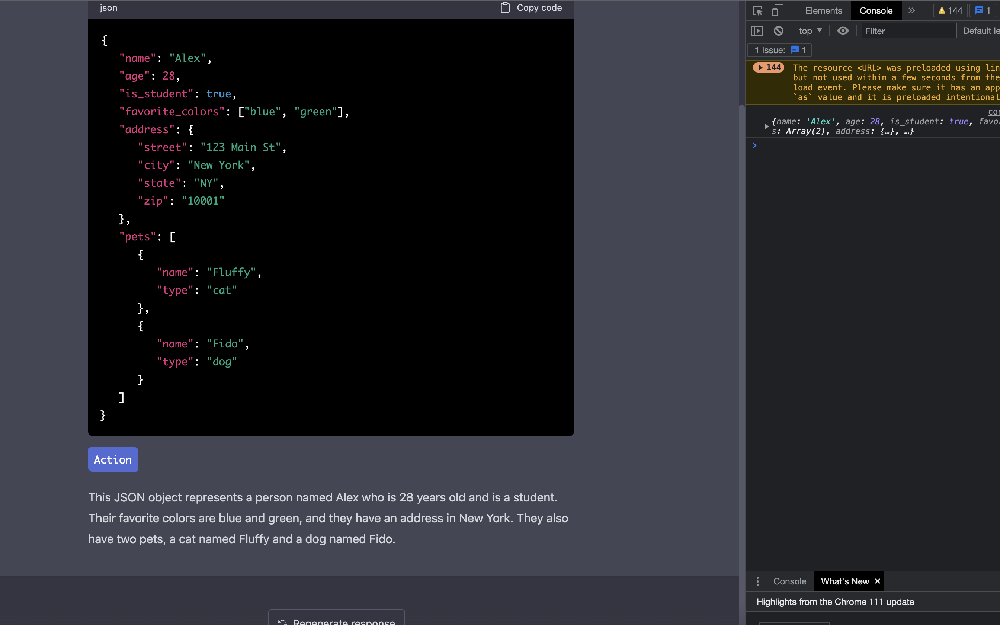

# simpleChatGPTExtension

## Description

Very simple example of how to get data out of chat gpt.
Adds a button to every ChatGPT response that contain JSON.
Clicking the button parses the json and just logs it.
Just update `scripts/content.json` with whatever you want to do with the data

## Install

1. Go to [chrome://extensions](chrome://extensions)
2. Click `Load Unpacked`
3. Point to the directory containg `manifest.json`
